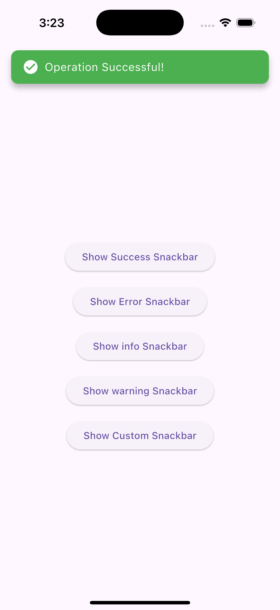
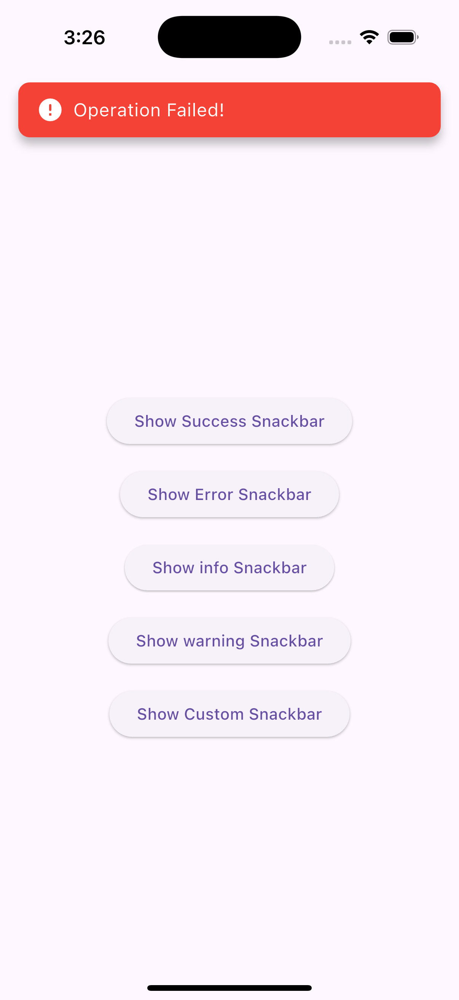
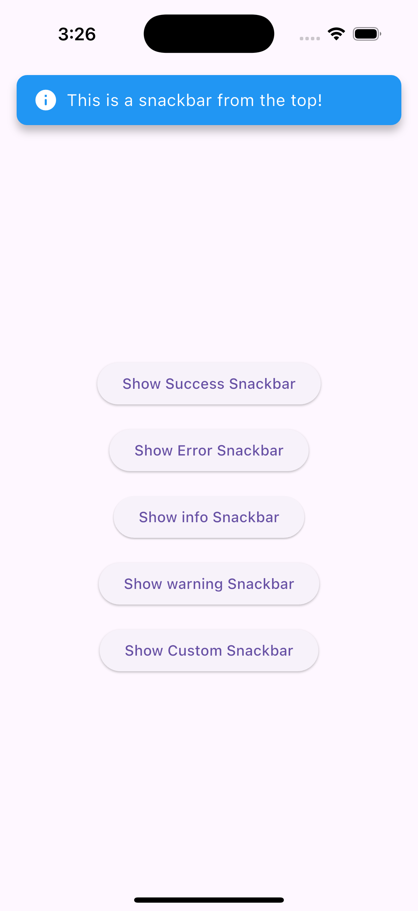
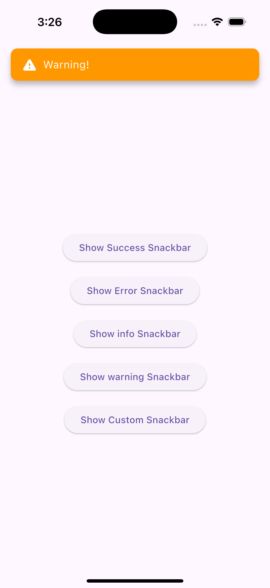
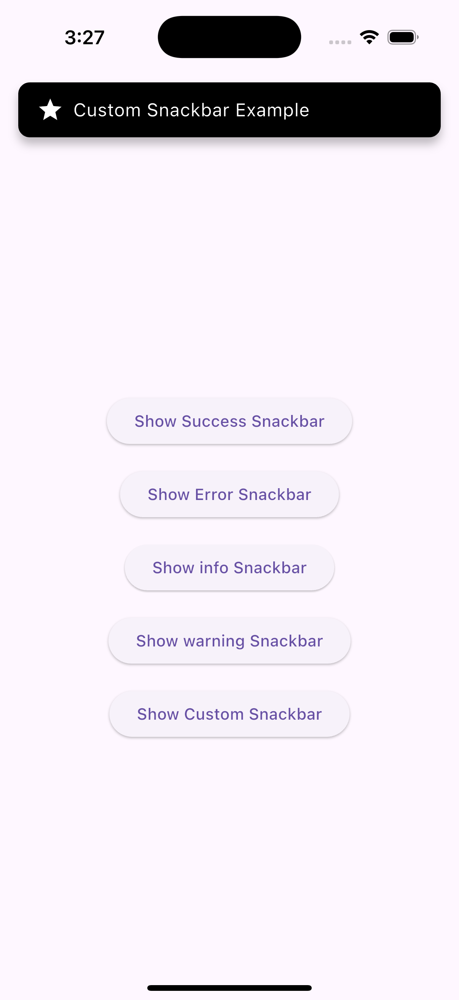

# flutter_top_snackbar

[](https://pub.dev/packages/flutter_top_snackbar)
[](LICENSE)
[](https://flutter.dev)

> **flutter_top_snackbar is a Flutter package to display customizable snackbars from the top of the screen.**  
> It supports multiple predefined themes (`success`, `info`, `error`, `warning`), custom icons, colors, and animations. Designed to be lightweight, easy to integrate, and fully customizable for any Flutter project.

---

## 📸 Demo

<div style="display: flex; flex-wrap: wrap; gap: 10px;">
  
  
  
  
  
</div>


---

## ✨ Features

- ✅ Show snackbar with **predefined themes**: `success`, `info`, `error`, `warning`
- 🎨 **Customizable**: use your own background color & icon
- 🎬 Multiple animations: `slideFromTop`, `fade`, `scale`, `slideFromLeft`, `slideFromRight`
- ⏳ Adjustable duration
- 🗑 `onDismissed` callback
- 🚪 Optional `isDismissible` flag and custom dismiss direction
- 📦 Lightweight and easy to integrate

---

## 📦 Installation

Add this to your **pubspec.yaml**:

```yaml
dependencies:
  flutter_top_snackbar: ^1.0.0
